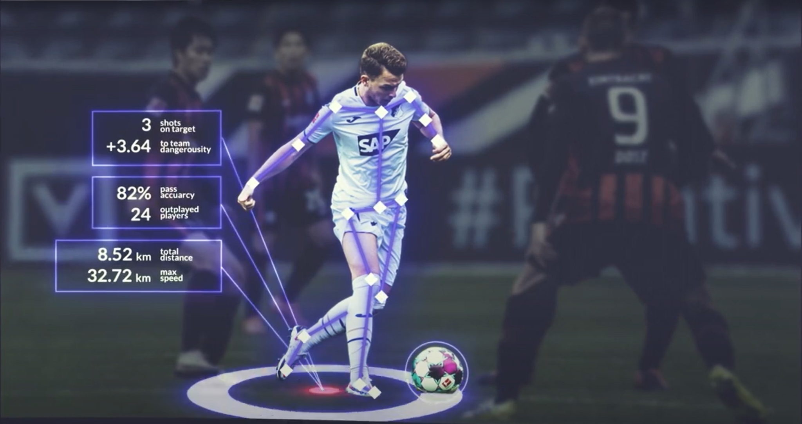

# SoccerNet
<table>
  <tr>
    <td>
      
    </td>
    <td style="text-align: left; padding-left: 20px;">
By harnessing the power of computer vision, we can transform the way soccer can be understood, watched, and even played. This project uses pre-trained Computer Vision models to analyze every moment of a match—tracking players, speeds, ball control, and more—to provide deep, actionable stats. Although no past ML experience is required, members should be very comfortable with Python as the overall goal of the project will be to build a Python package for soccer match analysis.
    </td>
  </tr>
</table>

